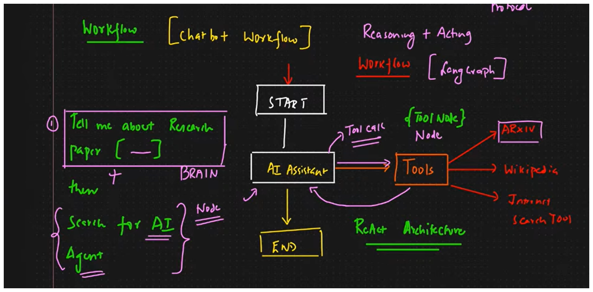

# LangGraph Agentic AI Chatbot – Key Concepts

- **LangGraph**: An open-source Python framework for designing agentic AI workflows and chatbots.
- **Agentic AI**: Bots that can *reason* and *act* (not just respond), making decisions and tool calls autonomously.
- **React Architecture**: Reason + Act workflow. Not ReactJS—here, it’s about agent thinking and then using tools/APIs.
- **Nodes**: Core functional units in the bot’s workflow (examples: AI Assistant Node, Tool Node).
- **Edges**: Pathways that connect nodes, dictating how the data and control flow.
- **Tool Integration**: Multiple external APIs/tools (e.g., Wikipedia, Arxiv paper search, Web Search) are bound and invoked based on context.
- **Tool Node**: Specialized node through which the bot calls external APIs or tools.
- **Conditional Edges**: Logic to decide if/when to call tools, loop between nodes, or terminate.
- **StateGraph**: Tracks and manages the agent’s state (like messages, context) throughout the workflow.
- **Pydantic TypeDict**: Used for type-safe state management, especially for message/history tracking.
- **LLM Binding**: Connecting the Language Model (like Groq, OpenAI) with tool nodes so it can intelligently choose/call tools.
- **Environment Variables/API Keys**: Used to securely connect to external APIs from the chatbot code.
- **Import/Installation**: Key packages: `langgraph`, `langchain`, external tool libraries, proper environment setup.

***

Use this cheat sheet for quick recall and clarity when working with **LangGraph agentic chatbots and frameworks**!

[1](https://www.youtube.com/watch?v=HCSPIH3I-vc&list=PLZoTAELRMXVPFd7JdvB-rnTb_5V26NYNO&index=3)

- **Following is the entire workflow on how it works**

There can be a query "Hi my name is Lalu, and tell me about a xyz research paper, and also tell me about the current news about bihar."
- so here, AI assistant i.e the brain, sees 3 different parts in the query:
1. Hi my name is Lalu (LLM can answer this itself, maybe hi,hello, e.t.c)
2. Tell me about a xyz research paper (LLM does not have this data, so it checks which tool can answer it, it is smart enough to understand, that it can be answered by arxiv tool)
3. Tell me about the current sttaus about bihar. (LLM does not have current data about bihar, so it checks tavily tool can do internent search and can answer it back)

so, this is how an ai assistant answers/solves a problem by identifying by reasoning, which can be answered by what source, and chooses that source without any human intervention, fetches the results, works with all rest of tools such as 3 tools here, and then combines the answers and gives it back to the user - This is what Agentic AI is.
where, each tool part handling is AI agents, each doing their specific tasks.
